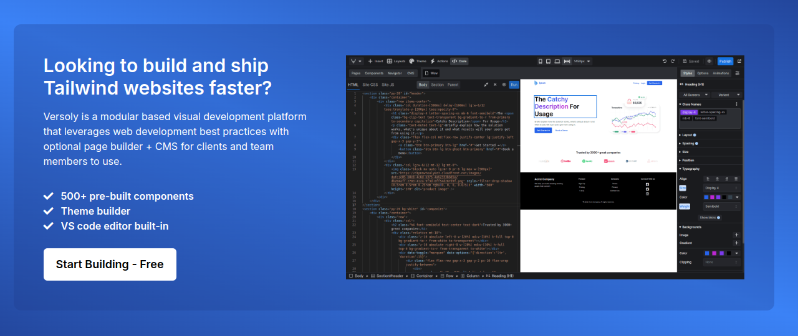

<div align="">
  <a href="https://versoly.com/taos" align=""><h1>TAOS</h1></a>
  <p>Tailwind CSS Animation on Scroll - A simple and small (600 bytes) library to help animate elements while scrolling using responsive Tailwind CSS utility classes. React & Vue supported.</p>

  <p>
      <a href="https://discord.versoly.com"></a>
      <a href="https://github.com/versoly/taos/blob/main/LICENSE.md"></a>
      <a href="https://unpkg.com/taos@1.0.5/dist/taos.js">
          
      </a>
  </p>
</div>

------

[](https://versoly.com/tailwind-page-builder?utm_source=github&utm_medium=repo&utm_campaign=image&utm_term=taos)

## Demo

To view 20+ examples of TAOS in action go to [versoly.com/taos](https://versoly.com/taos).


## Getting started

TAOS can be included as a plugin into an existing Tailwind CSS project and will allow you to add responsive Tailwind CSS utility classes for animation on scroll.

## Installation

### Install Tailwind Plugin


Install TAOS package
```js
npm install taos --save
```

Add plugin in `tailwind.config.js`
```js
module.exports = {
  plugins: [
    require('taos/plugin')
  ],
}

```

Add safelist utilties `tailwind.config.js`
```js
module.exports = {
  safelist: [
    '!duration-[0ms]',
    '!delay-[0ms]',
    'html.js :where([class*="taos:"]:not(.taos-init))'
  ]
}
```

Add content transform in `tailwind.config.js`
```js
module.exports = {
  content: {
    relative: true,
    transform: (content) => content.replace(/taos:/g, ''),
    files: ['./src/*.{html,js}'],
  },
}
```

### Add JavaScript scripts

Add script in `<head>`
```html
<script>document.documentElement.classList.add('js')</script>
```

Add the CDN script or download and paste right before the closing `</body>` tag
```html
<script src="https://unpkg.com/taos@1.0.5/dist/taos.js"></script>
```

## TAOS Frequently Asked Questions

### TAOS doesn't work for my use case can you add custom code just for me?

No, the goal of TAOS is to be as small as possible while providing the most functionality. We're looking into creating taos/core that would make it easy to plug into for custom use cases.

### Why do you use MutationObserver instead of IntersectionObserver

MutationObserver is a cleaner solution to check if the element is in view on page load and refresh. With IntersectionObserver it would require more code on top just to handle that part.

## 💡 JS Frameworks

- [React](https://github.com/versoly/taos/packages/react)
- [Vue](https://github.com/versoly/taos/packages/vue)


## 💡 Inspiration


- [AOS](https://github.com/michalsnik/aos): is a great library and works by using custom classes such as aos-animate to animate elements.
- [Tailwind](https://tailwindcss.com/): created an easy to use utility library that is easily extendable and flexible. Their variant and just in time compiler changed the game for developers.


## Community

If you need help or just want to discuss about the library join the community on Github:

[Discuss about Versoly on GitHub](https://github.com/versoly/taos/discussions)

For casual chatting with others using the library:

[Join the Versoly Discord Server](https://discord.versoly.com)
